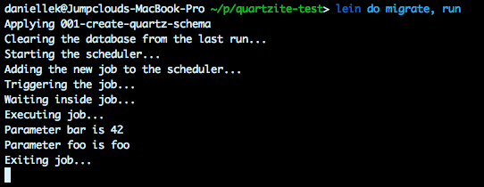
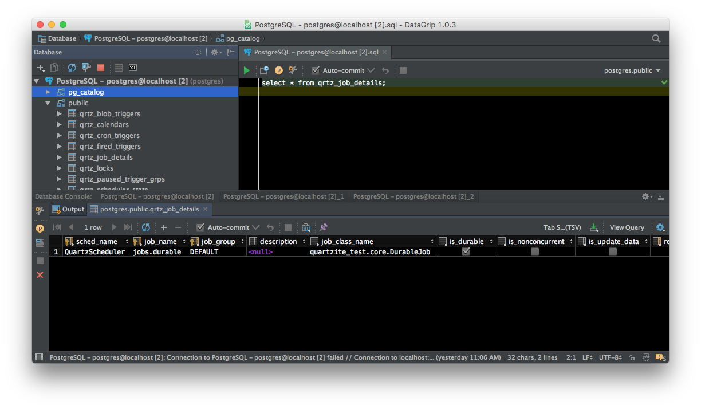

# quartzite-test

## Description

This started out as an experiment involving the Quartztite library to see if it fit the needs of another project. Specifically, we needed the following features:

* A simple way to invoke jobs asychronously and on demand, not requiring any scheduling configuration such as cron.
* A built-in way of storing job state in the database so that it could be queried later even if the application was restarted.

Investigation of this library led to having to research other things such as how to automate the running of database migrations, as well as needing to easily start up and shutdown a local database server. So the original scope of this little project widened into something surprisingly more interesting, and I felt warranted promotion to a project to be shared with others.

## Background

Quartzite is built on top of Quartz, which requires a database schema and only provides a DDL script (one per RDBMS implementation) which has to be run outside of Leiningen and there is no other means provided to migrte it... hat is, until I tried out the Ragtime library. To get everything set up properly I needed to:

* Include the Ragtime dependency in `project.clj`.
* Create a `resources\migrations` directory from the project root.
* Move the Quartz DDL script there and name it according to the convention required by Ragtime. (I also decided to split up the `create` and `down` statements into separate up and down scripts, `001-create-quartz-schema.up.sql` and `001-create-quartz-schema.down.sql`.)
* Implement `migrate` and `rollback` functions in one of the namespaces in this project; I chose the only one used, `quartite-test.core`.
* Set up task aliases in `profile.clj` to invoke those functions.

I also wanted to simplify the setup of a local database, and it turns out that that problem has been addressed too, namely the `lein-postgres` plugin. To get this working, I needed to:

* Set up the dependency in `:plugins` section of `project.clj`.
* Configure the port on which the Postgres instance would listen.
* Insure that the port specified in `project.clj` was consistent with that specified in the `quartzite.core` namespace for the Ragtime configuration. 
* Craft the JDBC URL in that same configuration to include the `postgres` user as a query parameter. (As far as I can tell, the user cannot be configured to be anything else in the `lein-postgres` section of `project.clj` nor any other way in the Ragtime configuration. If I am wrong, I'm open to corrections.)

Once I finally got al that working, the actual thing I wanted to demonstrate was being able to author and run jobs easily in Quartzite. Specifically, I hoped that the APIs weren't too complicated and that I didn't need to go through too much ceremony to accomplish this. 

Quartzite (and Quartz) supports running of jobs with and without so-called triggers. You can either create a job type and submit an instance of it to the scheduler, or if you desire you can create a trigger to be associated with that job type and run jobs on a scheduled basis. I only wanted to do the former, and it took me a little while for figure out how.

## Running the demo

This project requires Leiningen; you can find instructions on how to install it [here](http://www.leiningen.org/).

Download the project to a local directory:

    git clone https://github.com/quephird/quartzite-test

In one session, move into that directory and run the following:

    lein postgres

This will start up a local instance of Postgres without needing to explicitly download or install any external software. Running this task will block so you will need to start another session to continue.

In another terminal session, run the following:

    lein do migrate, run

This will create the schema for Quartz, then run the demo and will also block. 

At this point, you should be able to see various things echoed to the screen, including the parameters that were passed to the job:

You should also be able to open up a Postgres session and see that a record for the job should have been persisted:

TODO: Add more details about the Quartzite API, querying the database after a job has run.

## Conclusions

One of the things that was most disappointing about Quartzite (and really Quartz) was discovering that once jobs complete successfully, trigger records are deleted from the database. It is the trigger records which record the statuses of running jobs, but even if jobs fail, the corresponding trigger records are deleted. Moreover, there is nothing in the `qrtz_job_details` table that denotates final state nor otherwise differentiates successfully completed from failed ones. That is a key feature that we need for another project and in a sense a dealbreaker for our using this library.

## Future plans

There are a few more things I'd like to try out for this project:

* Be able to run `lein postgres` such that control returns to the invoking process and that subsequent Leiningen tasks can be chained and not requiring a user to spin up multiple terminal sessions.
* Be able to run the scheduler such that control can return to the invoking process.
* Be able to demonstrate querying the database, including figuring out how to query by parameter values.
* Figure out how to write the dynamic class loader purely in Clojure.

## Useful links

Quartzite, [https://github.com/quartzite](https://github.com/quartzite)

Quartz, [http://www.quartz-scheduler.org/](http://www.quartz-scheduler.org/)

Ragtime, [https://github.com/weavejester/ragtime](https://github.com/weavejester/ragtime)

`lein-postgres`, [https://github.com/whostolebenfrog/lein-postgres](https://github.com/whostolebenfrog/lein-postgres)

## License

Copyright (C) 2017, ⅅ₳ℕⅈⅇℒℒⅇ Ҝⅇℱℱoℜⅆ.

Distributed under the Eclipse Public License either version 1.0 or (at
your option) any later version.
